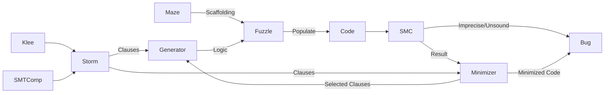

# Minotaur
Minotaur is a generative black-box fuzzer for software model checkers, based on [STORM](https://github.com/mariachris/storm) and [Fuzzle](https://github.com/SoftSec-KAIST/Fuzzle)

## About
Minotaur uses sat/unsat SMT-Files to generate programs that are unsafe/safe by construction. Optionally, [STORM](https://github.com/mariachris/storm)'s mutation algorithm can be used to create several variants for each seed. Optionally, a minimizer can be used to drop unneccessary clauses, which results in concise explanations for PA bugs.  


## Installation
```
git clone https://github.com/Fleischmaki/Minotaur.git
pip install -r Minotaur/requirements.txt
./Minotaur/scripts/build_MC_dockers.sh
```
Note that the provided dockers build most tools from source. Building might take up to a few hours and several GBs of memory.

## Using Minotaur
### Test Analyzers
Runs are configured via conf.json files located in Minotaur/test.
To perform a test using the config file test/conf_name.conf.json run `python3 Minotaur --t conf_name outdir`
For more info on config files check [config.md](./config.md)

### Generate a single maze
`python3 Minotaur --g {local,container} outdir params...` or ./Minotaur/scripts/generate.sh -o outdir [params...]. For parameter options see [params.md](./params.md)

### Minimize a maze
Run `python3 Minotaur --m report seed-dir out-dir {local,container}`, where 'report' the line of the summary.csv file from testing
Alternatively, first generate the maze and then run `python3 Minotaur --m maze.c seed-dir out-dir timeout {container,local} {fn,fp,er,...} tool [variant] [params]`

### Recreate an experiment 
Before recreating experiments, build the necessary experiments with ./Minotaur/scripts/build_experiment_dockers.sh
To run an experiment simply run `python3 Minotaur --e experiment_name outdir`. Experiment configurations are stored in the [experiments](Minotaur/experiments) folder.

## Bugs found by Minotaur
### Soundness Bugs
 Tool | Status | Type
 -- | -- | --
 CPA - InvariantsCPA | [fixed](https://gitlab.com/sosy-lab/software/cpachecker/-/issues/1114) | Overflow
Ultimate | [fixed](https://github.com/ultimate-pa/ultimate/issues/642#issuecomment-1661186726) | Overflow
CPA - InvariantsCPA | [fixed](https://gitlab.com/sosy-lab/software/cpachecker/-/issues/1130) | Bitwise Operations
CPA - Intervallanalysis | [confirmed](https://gitlab.com/sosy-lab/software/cpachecker/-/issues/1132#note_1544904422) | Overflow
Symbiotic | [open](https://github.com/staticafi/symbiotic/issues/247) | ??
Ultimate Automizer/Gemcutter | [fixed](https://github.com/ultimate-pa/ultimate/issues/646) | Bitwise Operators
ESBMC --interval-analysis | [fixed](https://github.com/esbmc/esbmc/issues/1363) | Type Casts
ESBMC --interval-analysis | [fixed](https://github.com/esbmc/esbmc/issues/1392) | Type Casts
CPA -InvariantsCPA | [fixed](https://gitlab.com/sosy-lab/software/cpachecker/-/issues/1194) | Modulo Operator
ESBMC --interval-analysis | [fixed](https://github.com/esbmc/esbmc/issues/1565) | Boolean Intervals
### Precision Issues
Tool | Status | Type
 -- | -- | --
 MOPSA | [confirmed](https://gitlab.com/mopsa/mopsa-analyzer/-/issues/150) | Type Casts
 MOPSA | [confirmed](https://gitlab.com/mopsa/mopsa-analyzer/-/issues/157) | ITE value propagation
 SeaHorn | [open](https://github.com/seahorn/seahorn/issues/546) |
 SeaHorn | [open](https://github.com/seahorn/seahorn/issues/550) |
### Other
Tool | Status | Type
 -- | -- | --
 Symbiotic | [open](https://github.com/staticafi/symbiotic/issues/246) | Arrays
 Ultimate Kojak | [fixed](https://github.com/ultimate-pa/ultimate/issues/647#event-10423593364) |
