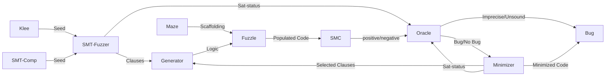

# Minotaur
Minotaur is a generative black-box fuzzer for software model checkers, based on [STORM](https://github.com/mariachris/storm) and [Fuzzle](https://github.com/SoftSec-KAIST/Fuzzle)

## About
Minotaur uses sat/unsat SMT-Files to generate programs that are unsafe/safe by construction. Optionally, [STORM](https://github.com/mariachris/storm)'s mutation algorithm can be used to create several satisfiable variants for each seed. UNSAT seeds can also be mutated, as long as the unsat-core remain intact. A minimizer can be used to drop unneccessary clauses for found seeds, which results in concise explanations for PA bugs.  

## Requirements
- Python3 >= 3.10
- Docker (or similar)

## Installation
```
git clone https://github.com/Fleischmaki/Minotaur.git
./Minotaur/scripts/build_MC_dockers.sh
# For recreating experiments #
./Minotaur/scripts/build_experiment_dockers.sh
```
Note that the provided dockers build most tools from source. Building might take up to a few hours and several GBs of memory.

If you want to generate mazes locally you will need to install the packages from [requirements.txt](requirements.txt)
```
pip install -r Minotaur/requirements.txt
``` 

If you want to use STORM update the STORM home in the [config file](Minotaur/src/maze_gen/storm/config.py).
## Using Minotaur
### Test Analyzers
Runs are configured via conf.json files located in the [test](Minotaur/test) folder.
To perform a test using the config file test/conf_name.conf.json run 
```
python3 Minotaur --t conf_name outdir
```
For more info on config files check [config.md](./config.md) and the example config files provided.

### Run experiments
Before recreating experiments, build the necessary experiment Dockers. Then run the experiment for a given config similarly to test config: 
```
./Minotaur/scripts/build_experiment_dockers.sh
python3 Minotaur --e experiment_name outdir
```
Experiment configurations are stored in the [experiments](experiments) folder. 
### Minimize a maze
```
python3 Minotaur --m report seed-dir out-dir {local,container}
```
'report' the line of the summary.csv file from testing.
Alternatively if you have the maze file you want to minimize, generate the maze and then run 
```
python3 Minotaur --m maze.c seed-dir out-dir timeout {container,local} {fn,fp,er,...} tool [variant] [params]
```

### Generate a specific maze
```
python3 Minotaur --g {local,container} outdir params...
```
Will generate the maze + any transformations specified. For parameter options see [params.md](./params.md)

### Filter accepted seed files
```
python3 Minotaur --c seed_dir outfile {sat,unsat}
```
will recursively search for compatible smtfiles for sat/unsat seed generation (=> unsafe/safe programs).
Compatible files will be written to outfile. Files can then be collected, e.g. with `mkdir safe_seeds && for f in $(cat outfile); do cp seed_dir/"$f" safe_seeds; done`.

### Logging
For all tools the logging level can be set via --LEVEL with LEVEL being one of E(rror), W(arning), I(nfo) or D(ebug). E.g. `python3 --t --D conf outdir` runs tests with log-level `DEBUG`. 

## Bugs found by Minotaur
### Soundness Bugs
Nr.  | Tool | Status | Type
| --  | -- | -- | -- |
1 | CPA - InvariantsCPA | [fixed](https://gitlab.com/sosy-lab/software/cpachecker/-/issues/1114) | Overflow
2 | Ultimate integer | [fixed](https://github.com/ultimate-pa/ultimate/issues/642#issuecomment-1661186726) | Overflow
3 |CPA - InvariantsCPA | [fixed](https://gitlab.com/sosy-lab/software/cpachecker/-/issues/1130) | Bitwise Operations
4 |CPA - Intervallanalysis | [confirmed](https://gitlab.com/sosy-lab/software/cpachecker/-/issues/1132#note_1544904422) | Overflow
5 |Symbiotic | [open](https://github.com/staticafi/symbiotic/issues/247) | ??
6 |Ultimate Automizer/Gemcutter integer | [fixed](https://github.com/ultimate-pa/ultimate/issues/646) | Bitwise Operators
7 |ESBMC --interval-analysis | [fixed](https://github.com/esbmc/esbmc/issues/1363) | Type Casts
8 |ESBMC --interval-analysis | [fixed](https://github.com/esbmc/esbmc/issues/1392) | Type Casts
9 |CPA -InvariantsCPA | [fixed](https://gitlab.com/sosy-lab/software/cpachecker/-/issues/1194) | Modulo Operator
10 |Seahorn - bpf | [closed (without fixing)](https://github.com/seahorn/seahorn/issues/545) | Bound inference
11 |ESBMC --interval-analysis | [fixed](https://github.com/esbmc/esbmc/issues/1565) | Boolean Intervals
12 |ESBMC --cvc4 | [fixed](https://github.com/esbmc/esbmc/issues/1770) | SMT translation
13 |CPA -InvariantsCPA | [confirmed](https://gitlab.com/sosy-lab/software/cpachecker/-/issues/1208) | Division
14 |ESBMC --mathsat| [confirmed](https://github.com/esbmc/esbmc/issues/1771) | 
15 | MOPSA congr | [fixed](https://gitlab.com/mopsa/mopsa-analyzer/-/issues/179) | 
16 | Ultimate integer| [closed](https://github.com/ultimate-pa/ultimate/issues/664) | Division-by-zero
17 | MOPSA excluded-powerset | [open](https://gitlab.com/mopsa/mopsa-analyzer/-/issues/182) |
18 | MOPSA cell-rel-itv | [closed](https://gitlab.com/mopsa/mopsa-analyzer/-/issues/183) | Outdated dependency | 
19 | Ultimate integer| [fixed](https://github.com/ultimate-pa/ultimate/issues/665) | Overflowing shift | 
20 | MOSPA cell-string-length-pointer-sentinel-pack-rel-itv-congr-rewrite | [open](https://gitlab.com/mopsa/mopsa-analyzer/-/issues/184) | |
21 | MOPSA congr | [open](https://gitlab.com/mopsa/mopsa-analyzer/-/issues/185) | Modulo? |
### Precision Issues
Nr. |Tool | Status | Type
| -- | -- | -- | -- |
1 | MOPSA | [confirmed](https://gitlab.com/mopsa/mopsa-analyzer/-/issues/150) | Type Casts
2 | MOPSA | [confirmed](https://gitlab.com/mopsa/mopsa-analyzer/-/issues/157) | ITE value propagation
3 | SeaHorn | [open](https://github.com/seahorn/seahorn/issues/546) | *inter-procedural analysis
4 | SeaHorn | [open](https://github.com/seahorn/seahorn/issues/550) |
5 | CPA -smg2 | [fixed](https://gitlab.com/sosy-lab/software/cpachecker/-/issues/1211) | 
6 | MOPSA | [confirmed](https://gitlab.com/mopsa/mopsa-analyzer/-/issues/177) | Type Casts
7 | 2ls --k-induction | [confirmed](https://github.com/diffblue/2ls/issues/177)
8 | MOPSA | [open](https://gitlab.com/mopsa/mopsa-analyzer/-/issues/178)|
9 | CBMC | [open](https://github.com/diffblue/cbmc/issues/8295) | Pointers
10| CPA -smg2| [confirmed](https://gitlab.com/sosy-lab/software/cpachecker/-/issues/1211#note_1904978360) |
11 | CBMC --refine | [open](https://github.com/diffblue/cbmc/issues/8295) 
### Other
Tool | Status | Type
 -- | -- | --
 Symbiotic | [open](https://github.com/staticafi/symbiotic/issues/246) | Arrays
 Ultimate Kojak | [fixed](https://github.com/ultimate-pa/ultimate/issues/647#event-10423593364) |
## Recreating ASE 2024 paper results
For more informations on the provided experiment configurations see [this guide](recreate_results.md) on how to recreate the experiment results. 

