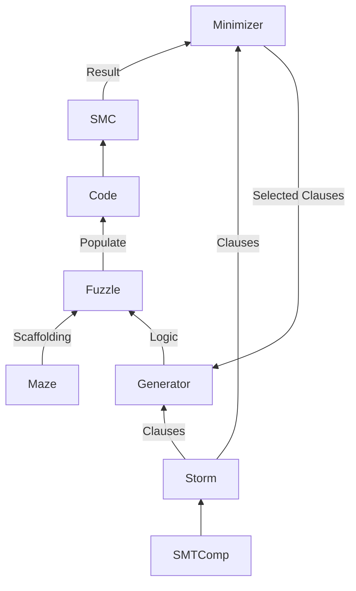

# Minotaur
Minotaur is a metamorphic testing tools for software model checkers, based on [STORM](https://github.com/mariachris/storm) and [Fuzzle](https://github.com/SoftSec-KAIST/Fuzzle)

## Installation
```
git clone https://github.com/Fleischmaki/Minotaur.git
pip install -r Minotaur/requirements.txt
./Minotaur/scripts/build_MC_dockers.sh
```
Note that the provided dockers build most tools from source. Building might take up to a few hours and several GBs of memory.

## Using Minotaur
### Run tests
Runs are configured via conf.json files located in Minotaur/test.
To perform a test using the config file conf_name.conf.json run `python3 Minotaur --t conf_name outdir`
For more info on config files check [config.md](./config.md)

### Generate a single maze
`python3 Minotaur --g outdir params...` or ./Minotaur/scripts/generate.sh -o outdir params...
See [params.md](./params.md)

### Minimize a maze
`python3 Minotaur --m maze.c tool [variant] seed_dir out_dir timeout`

## Bugs found by Minotaur
### Critical Bugs
 Tool | Status | Type
 -- | -- | --
 CPA - InvariantsCPA | [fixed](https://gitlab.com/sosy-lab/software/cpachecker/-/issues/1114) | Overflow
Ultimate | [fixed](https://github.com/ultimate-pa/ultimate/issues/642#issuecomment-1661186726) | Overflow
CPA - InvariantsCPA | [fixed](https://gitlab.com/sosy-lab/software/cpachecker/-/issues/1130) | Bitwise Operations
CPA - Intervallanalysis | [confirmed](https://gitlab.com/sosy-lab/software/cpachecker/-/issues/1132#note_1544904422) | Overflow
Symbiotic | [open](https://github.com/staticafi/symbiotic/issues/247) | ??
Ultimate | [fixed](https://github.com/ultimate-pa/ultimate/issues/646) | Bitwise Operators
ESBMC --interval-analysis | [fixed](https://github.com/esbmc/esbmc/issues/1363) | Type Casts
ESBMC --interval-analysis | [fixed](https://github.com/esbmc/esbmc/issues/1392) | Type Casts
CPA -InvariantsCPA | [fixed](https://gitlab.com/sosy-lab/software/cpachecker/-/issues/1194) | Modulo Operator
### Other bugs / Issues
Tool | Status | Type
 -- | -- | --
 Symbiotic | [open](https://github.com/staticafi/symbiotic/issues/246) | Arrays
 Ultimate Kojak | [fixed](https://github.com/ultimate-pa/ultimate/issues/647#event-10423593364) |
 MOPSA | [confirmed](https://gitlab.com/mopsa/mopsa-analyzer/-/issues/150) | Type Casts / Arrays
 MOPSA | [confirmed](https://gitlab.com/mopsa/mopsa-analyzer/-/issues/157) | ITE value propagation
## About

